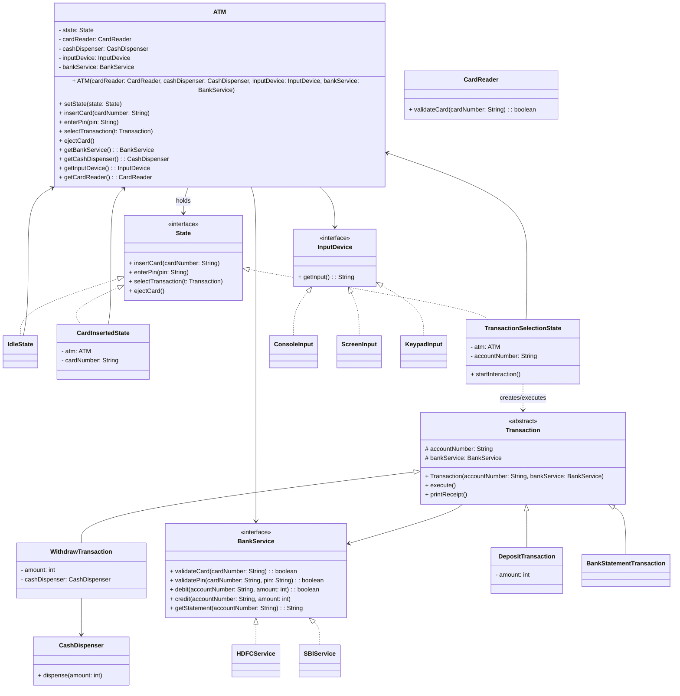

## ATM LLD - Class Diagram

```mermaid
classDiagram

class ATM {
  - state: State
  - cardReader: CardReader
  - cashDispenser: CashDispenser
  - inputDevice: InputDevice
  - bankService: BankService
  + ATM(cardReader: CardReader, cashDispenser: CashDispenser, inputDevice: InputDevice, bankService: BankService)
  + setState(state: State)
  + insertCard(cardNumber: String)
  + enterPin(pin: String)
  + selectTransaction(t: Transaction)
  + ejectCard()
  + getBankService(): BankService
  + getCashDispenser(): CashDispenser
  + getInputDevice(): InputDevice
  + getCardReader(): CardReader
}

class CardReader {
  + validateCard(cardNumber: String): boolean
}

class CashDispenser {
  + dispense(amount: int)
}

class IdleState
class CardInsertedState {
  - atm: ATM
  - cardNumber: String
}
class TransactionSelectionState {
  - atm: ATM
  - accountNumber: String
  + startInteraction()
}

class State <<interface>> {
  + insertCard(cardNumber: String)
  + enterPin(pin: String)
  + selectTransaction(t: Transaction)
  + ejectCard()
}

ATM --> State : holds
State <|.. IdleState
State <|.. CardInsertedState
State <|.. TransactionSelectionState
IdleState --> ATM
CardInsertedState --> ATM
TransactionSelectionState --> ATM

class InputDevice <<interface>> {
  + getInput(): String
}
class ConsoleInput
class ScreenInput
class KeypadInput
InputDevice <|.. ConsoleInput
InputDevice <|.. ScreenInput
InputDevice <|.. KeypadInput
ATM --> InputDevice

class BankService <<interface>> {
  + validateCard(cardNumber: String): boolean
  + validatePin(cardNumber: String, pin: String): boolean
  + debit(accountNumber: String, amount: int): boolean
  + credit(accountNumber: String, amount: int)
  + getStatement(accountNumber: String): String
}
class HDFCService
class SBIService
BankService <|.. HDFCService
BankService <|.. SBIService
ATM --> BankService

class Transaction <<abstract>> {
  # accountNumber: String
  # bankService: BankService
  + Transaction(accountNumber: String, bankService: BankService)
  + execute()
  + printReceipt()
}
class WithdrawTransaction {
  - amount: int
  - cashDispenser: CashDispenser
}
class DepositTransaction {
  - amount: int
}
class BankStatementTransaction

Transaction <|-- WithdrawTransaction
Transaction <|-- DepositTransaction
Transaction <|-- BankStatementTransaction

TransactionSelectionState ..> Transaction : creates/executes
WithdrawTransaction --> CashDispenser
Transaction --> BankService
```

